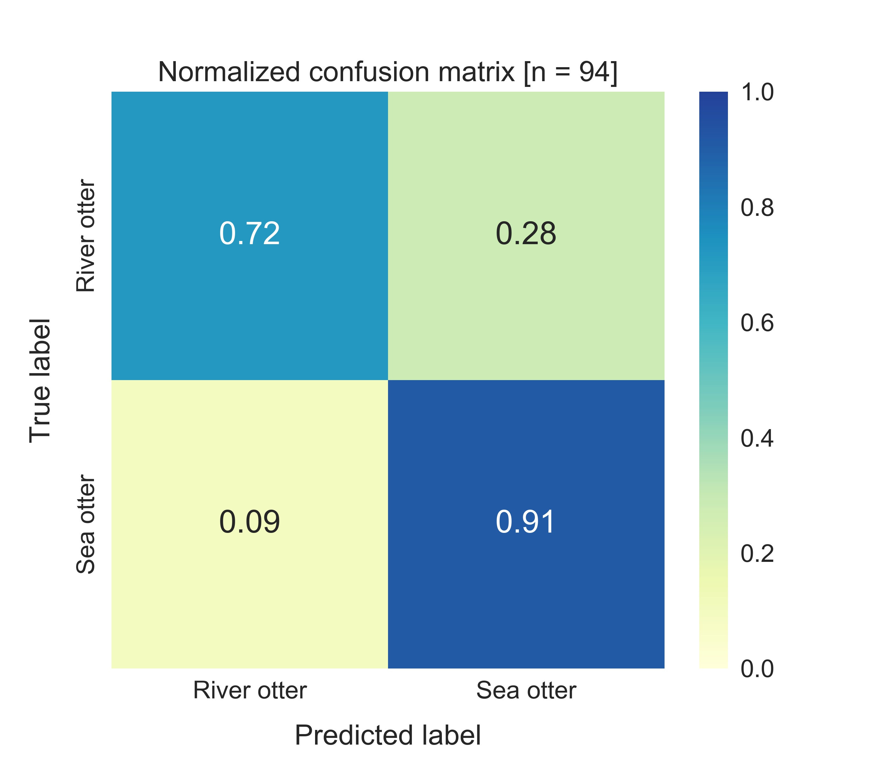
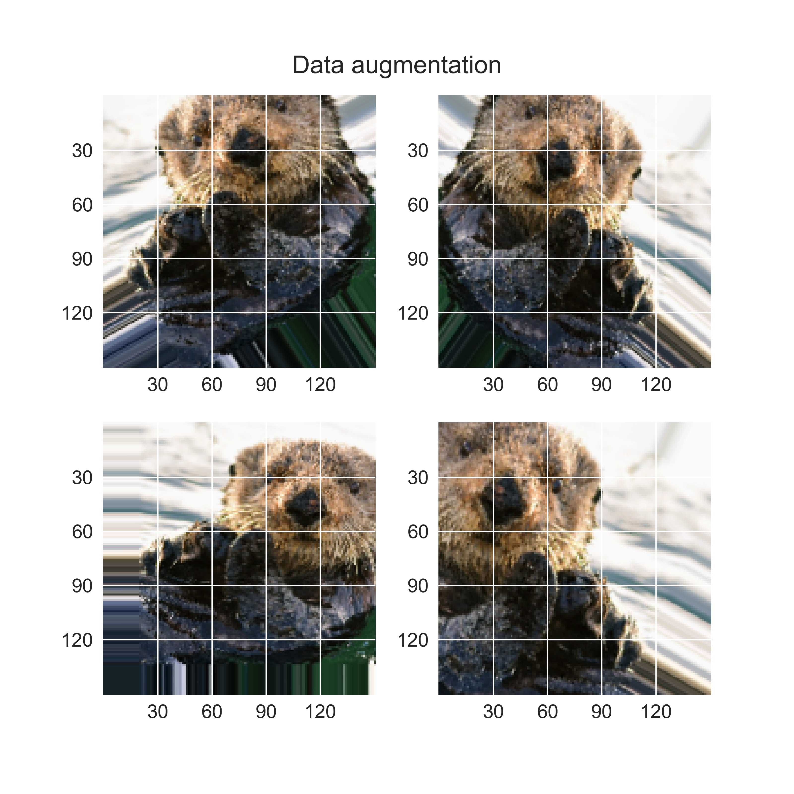

# CNN_otters
To classify images as a river otter or sea otter via a CNN model.
* Samples in training process: 200 photos
* Samples in validation process: 200 photos
* Samples in test process: 94 photos

## Confusion matrix

## Data augmentation

